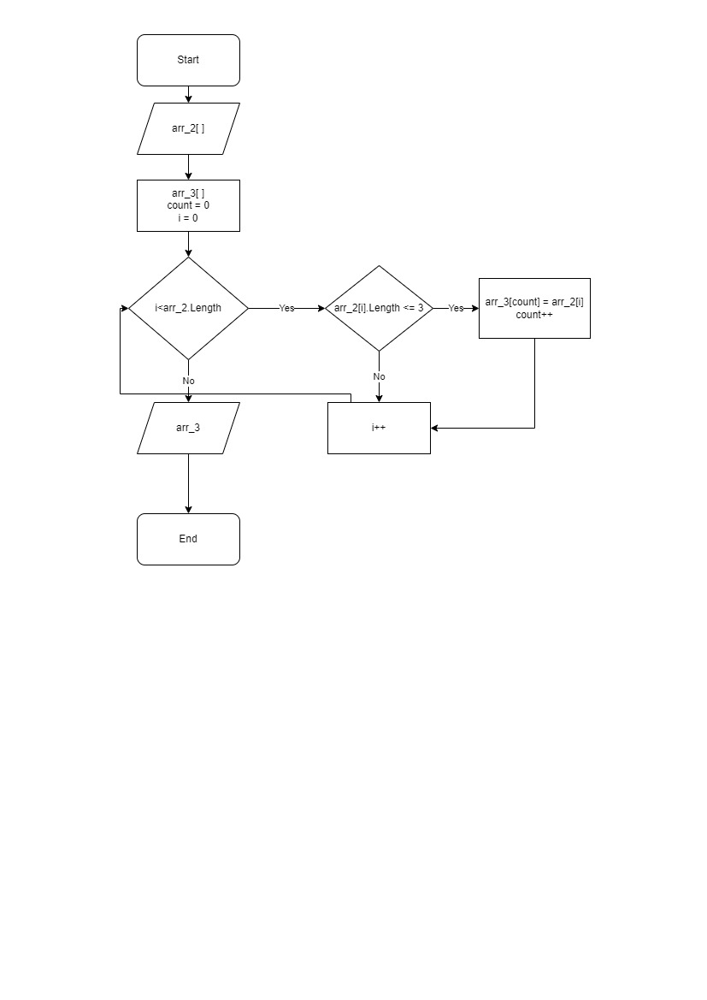

# Задача

Написать программу, которая из имеющегося массива строк формирует новый массив из строк,
длина которых меньше, либо равна 3 символам.
Первоначальный массив можно ввести с клавиатуры, либо задать на старте выполнения алгоритма. 
При решении не рекомендуется пользоваться коллекциями, лучше обойтись массивами.

# Описание решения

1. Создаем три метода: *Print, Words, Words_2.*

1. *Print* будет выводить сформированные массивы. 

1. *Words* будет принимать строки и формировать из них массив, состоящий из четырех элементов. Метод будет возвращать сформированный массив.  

1. *Words_2* будет принимать массив arr_2 и формировать из него новый. Внутри метода указываем, что помимо введенного у нас будет еще один массив arr_3. Вводим переменную count - это будет индекс нового массива. Создаем цикл for, который будет перебирать элементы введенного массива и формировать новый. Внутри цикла будет условие, по которому если длина конкретного элемента введенного массива arr_2 меньше 3, то этот элемент становится элементом нового массива arr_3. При этом каждый раз индекс элементов нового массива count будет увеличиваться на один. Иначе в новый массив попадет лишь один элемент. В итоге метод будет возвращать новый массив arr_3.

1. Вводим с клавиатуры четыре строки и вызываем методы *Words, Words_2 и Print.*

# Блок-схема основного метода решения

